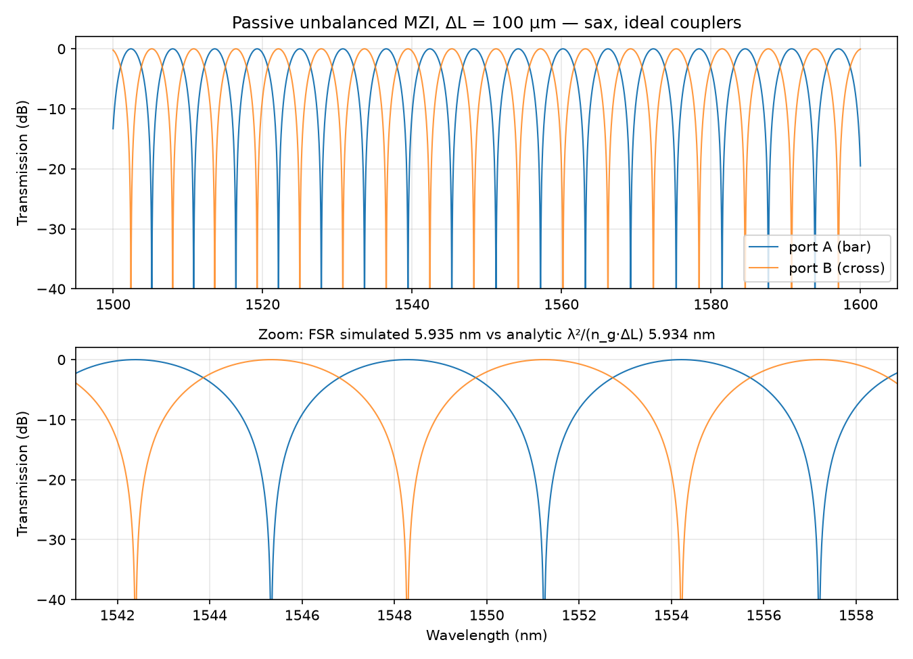
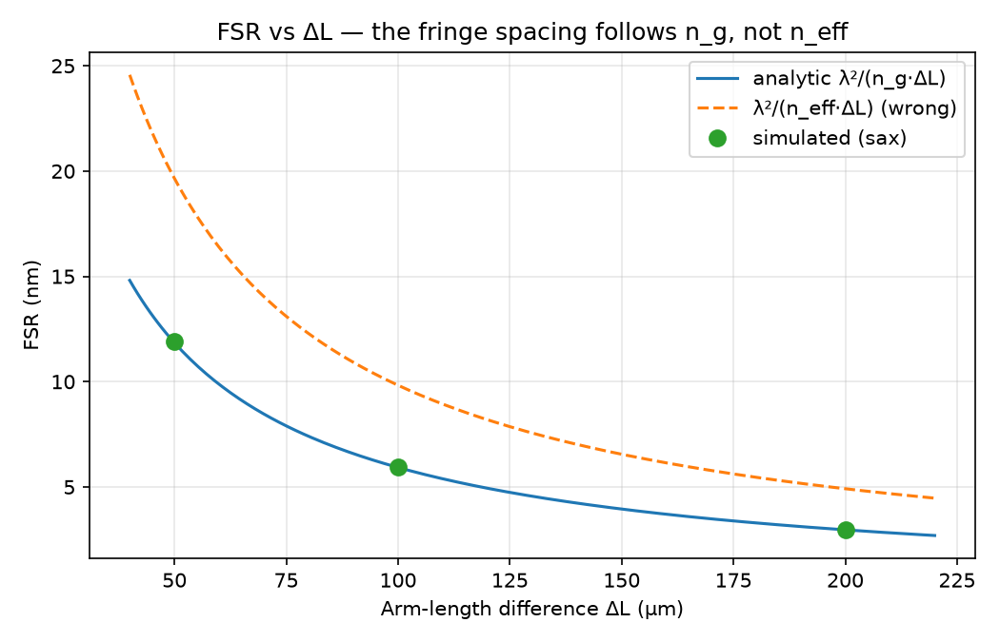
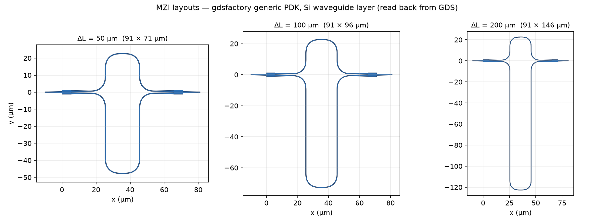

# Passive Unbalanced Mach-Zehnder Interferometer — Silicon Photonics

Mode-solve → circuit-simulation → layout flow for a passive unbalanced MZI on a standard 220 nm SOI platform, built entirely with open-source tools (MPB, sax, gdsfactory, KLayout).

The goal is a single, traceable chain: **measure the waveguide's indices from its geometry, use them to predict the MZI's free spectral range analytically, then confirm that prediction with an independent circuit-level simulation.**

---

## Headline results

**Waveguide:** Si strip, 500 nm × 220 nm, SiO₂-clad (n_Si = 3.48, n_SiO₂ = 1.44), TE₀, λ = 1550 nm

| Quantity | Value | How obtained |
|---|---|---|
| Effective index n_eff | **2.4445** | MPB eigenmode solve |
| dn_eff/dλ | −1.0392 µm⁻¹ | finite difference, 1540/1550/1560 nm |
| Group index n_g (method A) | **4.0552** | n_eff − λ·dn_eff/dλ |
| Group index n_g (method B) | **4.0552** | MPB native group velocity |
| A vs B agreement | 0.00 % | self-consistency check |

**MZI free spectral range, FSR = λ² / (n_g · ΔL):**

| ΔL | FSR predicted (analytic) |
|---|---|
| 50 µm | 11.85 nm |
| 100 µm | 5.92 nm |
| 200 µm | 2.96 nm |

**Circuit simulation (sax), FSR simulated vs analytic λ²/(n_g·ΔL) around 1550 nm:**

| ΔL | FSR simulated | FSR analytic | Difference | If n_eff were used |
|---|---|---|---|---|
| 50 µm | 11.915 nm | 11.914 nm | +0.01 % | 19.76 nm |
| 100 µm | 5.935 nm | 5.934 nm | +0.02 % | 9.84 nm |
| 200 µm | 2.965 nm | 2.961 nm | +0.13 % | 4.91 nm |

The straight-waveguide model carries the measured dispersion (n_eff varies linearly with λ about 1550 nm), so the simulated fringe spacing is set by n_g — and it lands on the analytic prediction. Energy conservation holds to ~1e-15 (T_bar + T_cross = 1).





### Layout



Physical layouts for each ΔL, generated with gdsfactory's parametric MZI (generic PDK, 500 nm Si waveguides) and written to GDS: [`mzi_dL50um.gds`](results/mzi_dL50um.gds), [`mzi_dL100um.gds`](results/mzi_dL100um.gds), [`mzi_dL200um.gds`](results/mzi_dL200um.gds). The image above is drawn by reading those GDS files back with KLayout's Python API. Open the GDS files in KLayout to inspect them directly.

The extra arm length ΔL is folded into the lower loop, so the footprint grows vertically (71 → 146 µm) while the width stays at ~91 µm. The layout uses gdsfactory's default 1×2 MMI splitter/combiner; the circuit model uses an idealized 50/50 coupler. The FSR depends only on n_g and ΔL, so it is unaffected; matching the circuit model to the layout's actual splitter is part of the non-ideal-coupler next step.

Using n_eff instead of n_g in the FSR formula would predict ~9.8 nm at ΔL = 100 µm — a ~66 % error. That gap is the main physics point this project demonstrates.

---

## Repository layout

```
scripts/
  mzi_smoke_test.py          # MPB mode solve: n_eff, n_g (two methods), FSR prediction table
  mzi_from_scratch.py        # pure-NumPy transfer-matrix MZI, overlaid on sax (cross-check)
  mzi_circuit_and_layout.py  # sax wavelength sweep for ΔL = 50/100/200 µm + gdsfactory layout
results/                     # spectra plots, GDS layouts + layout image, console summary
docs/
  theory.md                  # MZI transfer function and FSR derivation
environment.yml              # conda environment (pymeep)
```

## Method

1. **Mode solve (MPB).** Solve the fundamental TE mode of the 500 × 220 nm strip cross-section (3 µm × 3 µm window, 64 px/µm). Extract n_eff at 1550 nm and n_g by two independent routes; agreement is the pass criterion.
2. **Analytic prediction.** Phase difference Δφ = 2π·n_eff·ΔL/λ; transmission T_bar = cos²(Δφ/2), T_cross = sin²(Δφ/2); FSR = λ²/(n_g·ΔL).
3. **Circuit simulation (sax).** Compose S-matrices for the splitter, the two arms and the combiner; sweep 1500–1600 nm (20,001 points); extract FSR from the spacing of the two peaks straddling 1550 nm. T_bar + T_cross = 1 is checked as an energy-conservation sanity test.
4. **Independent cross-check.** The same MZI written from scratch as 2×2 transfer matrices in NumPy, overlaid on the sax result: maximum difference 1.14e-13 across the sweep (`results/mzi_scratch_vs_sax.png`).
5. **Layout.** gdsfactory generates the MZI geometry for each ΔL and writes GDS; the GDS files are read back with KLayout's Python API and drawn to an image (a layout round-trip check).

Full derivation: [`docs/theory.md`](docs/theory.md).

## Reproduce

```bash
conda env create -f environment.yml
conda activate pymeep
python scripts/mzi_smoke_test.py
python scripts/mzi_from_scratch.py
python scripts/mzi_circuit_and_layout.py
```

Developed and run on macOS (Apple Silicon, M2 Max). Tool versions: MEEP 1.34.0, MPB 1.12.0, gdsfactory 9.49.0, gplugins 2.1.5, sax 0.18.2, KLayout 0.30.

---

## Scope and assumptions

This is an **idealized circuit-level simulation**:

- couplers are perfect, lossless 50/50 splitters;
- the arms are lossless;
- the waveguide is single-mode TE with no fabrication variation;
- the material indices are constant (n_Si = 3.48, n_SiO₂ = 1.44) at every wavelength.

Under those assumptions an infinite extinction ratio and 0 dB insertion loss are the *correct* outputs, not predictions of real device performance. The result that rests on a physical property rather than an idealization is the **FSR**, because it derives from the mode-solved group index n_g — with the dispersion caveat below.

The constant-index assumption means the extracted n_g = 4.0552 captures **waveguide (geometric) dispersion only**. Real silicon's index also varies with wavelength, and that material dispersion raises n_g. Literature values for a real 500 × 220 nm strip are around 4.2, and FSRs predicted from this model will be correspondingly a few percent too large.

Likewise, the two n_g methods agreeing validates the extraction, not the grid: both use the same 64 px/µm mode solve. A resolution-convergence check (e.g. 96 px/µm) is listed under next steps.

## Next steps

- [ ] Add silicon and oxide material dispersion (Sellmeier models) to the mode solve, and repeat at a finer grid to confirm resolution convergence
- [ ] Add propagation loss (~1–3 dB/cm) and non-ideal coupler models (MEEP-simulated S-parameters via gplugins) to get realistic ER and IL
- [ ] Move the layout to the SiEPIC EBeam PDK and pass DRC, toward an openEBL-style tape-out
- [ ] Convert to an active device: thermo-optic heater or pn-junction phase shifter in one arm (DEVSIM for the carrier model)

## Tools and AI assistance

This project was done as self-study, with Claude (Anthropic's AI assistant) used throughout as a tutor and coding aid. Claude explained theory, helped write and debug the simulation scripts, and reviewed my reasoning, including correcting several misconceptions in my early understanding of the MZI.

I set up the toolchain and ran every simulation on my own machine. I also verified the results independently:

- n_g computed by two independent methods (agreement 0.00 %);
- the sax spectrum cross-checked against a from-scratch NumPy transfer-matrix model (agreement 1.14e-13);
- the simulated FSR checked against the hand-calculated analytic prediction (within 0.13 % for all three ΔL values).

I can derive and explain each step of the method and the theory in [`docs/theory.md`](docs/theory.md).

## Author

Vineel Patibanda — self-directed silicon photonics study, 2026.

## License

MIT — see [LICENSE](LICENSE).
